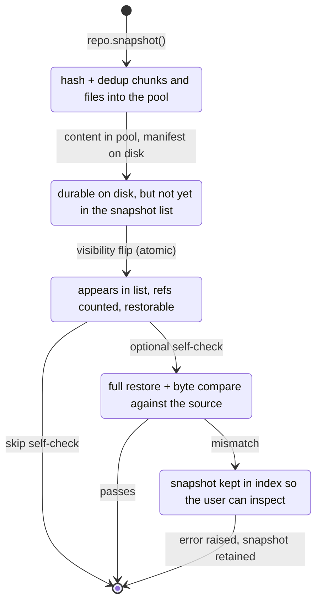
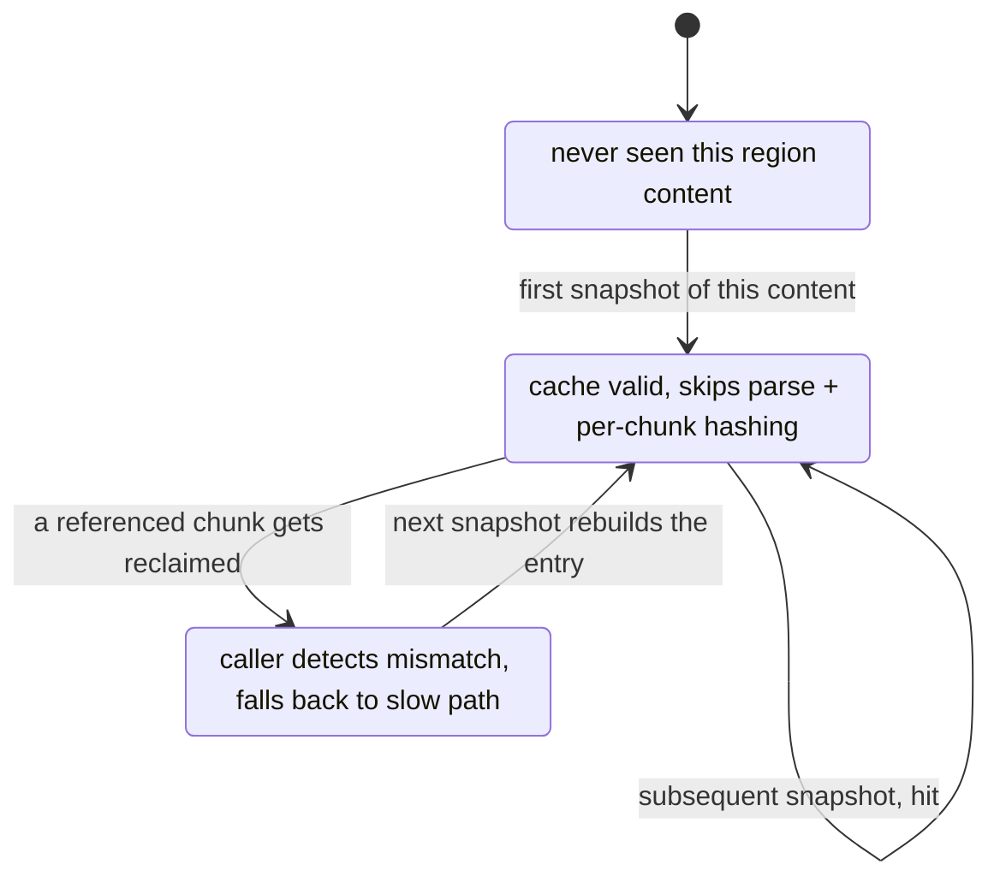

# chunkvault

[English](README.md) | **中文**

> **Minecraft Java 世界的 chunk 级增量备份。**
> 是一个库,不是 mod,用于保留多年历史快照而不让仓库随快照数量线性膨胀。

```
┌─────────────────────────────────────────────────────────────┐
│  快照很多、磁盘适中    ─►  chunk 级去重                     │
│  跨版本                ─►  按 chunk 保留每个版本的内容      │
│  多服务器压缩包        ─►  一条命令搞定                     │
│  chunk 级 diff + 地图  ─►  内置                             │
└─────────────────────────────────────────────────────────────┘
```

[]() []()

---

## 问题所在

现有的 Minecraft 备份工具几乎都按**整个 region 文件**为单位存储。问题是,MC 频繁地重写这些文件 —— 每次 chunk 加载都会更新 `LastUpdate` 字段,zlib 输出会变,git / restic / rsync 这类工具看到"字节不一样了 → 存一份新的"。即使内容没什么实质变化,每天的备份也会线性堆积。

真正变的内容 —— 也就是 chunk —— 其实很少。任何已探索的世界,大部分区域在两次游戏之间都没被动过。**chunkvault 按 chunk 粒度存储**,所以没变的 chunk 永远不会被存第二份。仓库的增长跟实际 delta 走,而不是跟快照数量走。

---

## 这个库提供什么

| | |
|---|---|
| **chunk 级去重** | 按 hash 寻址的 chunk 池。同一个 chunk 跨 N 个快照只存一份。 |
| **跨版本感知** | 存储原始字节 payload;1.7 和 1.21 都能用。读取 `level.dat` 记录每个快照的 `mc_version`。 |
| **Carpet 友好** | 原版 MCA 格式 = 原版 parser。Carpet 的额外配置文件走整文件去重。 |
| **多服务器压缩包导入** | 一条 `chunkvault ingest backup.zip` 自动识别 `EX-Server/`、`CR-Server/` 等子目录,分别拍快照,日志独立采集。 |
| **日志独立处理** | 日志和 crash 报告进入并行的去重池。可独立浏览、提取、删除,不影响世界历史。 |
| **交互式 wizard** | 不带参数运行 `chunkvault` 即进入 rich 驱动的 TUI:自动检测仓库和源压缩包,引导配置,实时显示进度。 |
| **chunk 级 diff + 地图** | 仅靠 manifest 比较任意两个快照,与世界大小无关。可渲染 PNG 热力图或自包含的 Leaflet HTML(可选叠加 unmined 底图)。 |
| **校验 + GC** | `chunkvault verify` 重哈希所有 blob;`gc` 用引用计数快路径回收无引用 chunk(O(已删除),不是 O(N×M))。 |
| **两套后端** | 默认是 chunk store(推荐),另有受 FastBack 启发的 git 后端 —— 想要 git 体验、不在乎更大空间占用的用户可以选。 |

---

## 为什么不用 [其他工具]

|  | git / FastBack | restic / borg | **chunkvault** |
|---|---|---|---|
| 去重单位 | 整个 region 文件 | 通用内容定义 chunk | **MC chunk**(逻辑) |
| 抗 MC 的 `LastUpdate` 抖动 | ✗(误报) | 部分 | **✓** |
| 跨版本元数据 | ✗ | ✗ | **✓**(每快照 `mc_version`) |
| 实时进度 UI | ✗ | 部分 | **✓**(rich) |
| 单文件还原 | ✓ | ✓ | **✓** |
| 多服务器压缩包导入 | ✗ | ✗ | **✓** |

---

## 安装

```bash
pip install -e .                  # 或:pip install chunkvault(发布之后)

# 验证安装并显示 CLI 帮助
chunkvault --help
```

需要 **Python 3.11+**。Pillow 是唯一的硬运行时依赖。`git` 仅当你启用 git 后端(`--store=git`)时才需要。`unmined` 可选,只有想在 diff 叠加层下显示真实地图底图时才用。

---

## 30 秒快速开始

```bash
# 1. 初始化 vault
chunkvault init D:/backup-vault

# 2. 给一个活动世界拍快照(或用 `chunkvault ingest <zip>` 处理压缩包)
chunkvault snapshot D:/backup-vault D:/servers/smp/world --label "before-raid"

# 3. 之后再拍一张然后 diff
chunkvault diff-snaps D:/backup-vault before-raid after-raid \
    --html diff.html --png region heat.png

# 4. 从任意快照恢复单个文件
chunkvault restore D:/backup-vault before-raid D:/tmp \
    --path region/r.0.0.mca

# 5. 删除快照后回收空间
chunkvault delete D:/backup-vault before-raid
chunkvault gc D:/backup-vault
```

或者懒得敲命令:

```bash
chunkvault          # 直接进入交互 wizard
```

---

## Wizard

`chunkvault` 不带子命令时启动交互式 TUI。它会自动检测周围环境,要求你确认,然后带实时进度运行。

```
chunkvault interactive wizard
detecting environment…

┌─ Detected chunkvault repos ──────────────────────────────────────────┐
│ path                  kind    snapshots  log snaps  on-disk          │
│ D:\backup-vault       chunk          47         12  812.4 GB         │
└──────────────────────────────────────────────────────────────────────┘

┌─ Source archive locations ───────────────────────────────────────────┐
│ path                archives  total bytes  samples                   │
│ D:\backups\               87       6.8 TB  2024-08-15-23-30-00.zip…  │
│ E:\old-saves\             12     800.2 GB  2022-12-25-20-00-00.zip…  │
└──────────────────────────────────────────────────────────────────────┘

╭─ Main menu ──────────────────────────────────────────────────╮
│  你想做什么?                                                  │
│    导入备份压缩包     — 批量导入备份 zip                      │
│    快照活动世界       — 单个 MC world/ 目录                   │
│    对比两个快照                                                │
│    列出所有快照                                                │
│    完整性校验                                                  │
│    垃圾回收(回收空间)                                       │
│    退出                                                        │
╰──────────────────────────────────────────────────────────────╯
```

确认后,你会看到每个 archive、region、文件的丰富进度条,带耗时/ETA + 实时计数。

**多语言支持。** Wizard 内置 9 种语言(English / 简体中文 / 繁體中文 / 日本語 / 한국어 / Deutsch / Français / Español / Русский)。在主菜单选 "Switch language" / "切换语言",或设置环境变量 `CHUNKVAULT_LANG=zh-CN`,或编辑 `~/.chunkvault/config.json`。

---

## CLI 参考

### 仓库生命周期
```
chunkvault init REPO                      初始化 chunk-store vault
chunkvault verify REPO [--repair]         重哈希所有 blob,检测位翻转
chunkvault gc REPO                        回收已删除快照的空间
```

### 世界快照
```
chunkvault snapshot REPO WORLD [--label L] [--allow-live]
chunkvault list REPO
chunkvault restore REPO SNAP DEST [--path P …]
chunkvault delete REPO SNAP
```

### 多服务器压缩包
```
chunkvault ingest REPO ARCHIVE [--skip-logs]   导入 YYYY-MM-DD-HH-MM-SS.zip
chunkvault import REPO ARCHIVE                  单世界压缩包(旧别名)
```

### 日志(并行子系统)
```
chunkvault logs-list REPO
chunkvault logs-extract REPO SNAP DEST [--server NAME]
chunkvault logs-delete REPO SNAP
```

### Diff + 可视化
```
chunkvault diff       OLD_DIR NEW_DIR  [--json] [--png DIM FILE] [--html FILE]
chunkvault diff-snaps REPO SNAP_A SNAP_B [--json] [--png DIM FILE] [--html FILE]
chunkvault render     OLD NEW DIM -o FILE       仅 PNG 热力图
chunkvault render-tiles WORLD OUTPUT             unmined 底图渲染
```

### 修复工具
```
chunkvault repair-timestamps REPO [--apply]   全 vault 时间戳/标签对齐 + 排重
chunkvault retime REPO SNAP --from-level-dat  单个快照按 level.dat 重新对齐
chunkvault verify-folders A B [--report PATH] 字节级对比两个目录
chunkvault verify-roundtrip REPO SNAP ORIG    快照 vs 原目录对比
chunkvault fsck REPO [--repair]               清理半成品状态
```

### 后端切换
所有存储相关命令都接受 `--store=chunk|git`。**默认是 chunk。** 仅当你需要 git 的体验(比如对快照历史跑 `git log`),且能接受更大的空间占用时,才用 `--store=git`。

---

## Library API

```python
from chunkvault.store import ChunkSnapshotRepo

repo = ChunkSnapshotRepo("D:/backup-vault")
repo.init()

# 带实时进度的快照
def on_event(e):
    print(f"{e.phase}: {e.current}/{e.total}  {e.label}")

snap = repo.snapshot(
    "D:/servers/smp/world",
    label="before-raid",
    progress_cb=on_event,
)

# 比较两个快照 —— 仅读 manifest,与世界大小无关
diff = repo.diff_snapshots("before-raid", "after-raid")
print(diff.count_by_kind())              # {"added": …, "modified": …, "removed": …}
print(diff.version_changed())            # DataVersion 是否变了

# 渲染交互地图
from chunkvault.viz import render_diff_html
render_diff_html(diff, out_path="diff.html",
                 base_tiles_url="./tiles/{z}/{x}/{y}.png")

# 还原单个文件
repo.restore(snap, "D:/tmp", paths=["region/r.0.0.mca"])
```

### 多服务器 archive 两行搞定

```python
from chunkvault.store import ChunkSnapshotRepo, ingest_archive

repo = ChunkSnapshotRepo("D:/backup-vault"); repo.init()
result = ingest_archive(repo, "D:/backups/2025-04-25-12-34-56.zip")
# → 给 EX-Server/world、CR-Server/world 各拍快照;采集所有日志;
# 时间戳来自每个 server 的 level.dat LastPlayed。
```

---

## 架构

```
chunkvault/
├── mca/                ← MCA region 解析、NBT-lite、内容哈希
│   ├── region.py       Region(path) / Region.from_bytes() —— 只读 parser
│   ├── hasher.py       blake2b-128 内容哈希(MC 感知)
│   ├── nbt_lite.py     轻量级 NBT 读取器(不依赖 amulet)
│   └── semantic.py     chunk_data_version、chunk_block_palette
│
├── world/              ← 世界布局枚举(原版 + datapack)
├── diff/               ← WorldDiff、ChunkDiff、容错对比
│
├── storage/            ← Git 后端(FastBack 风格,可选)
│   ├── repo.py         孤儿分支快照,*.mca 关闭 delta
│   ├── batch.py        cat-file --batch(避免每个 blob 起一次进程)
│   └── cache.py        SQLite hash 缓存,加速 diff
│
├── store/              ← chunk-store 后端(默认)
│   ├── chunk_store.py  内容寻址池:chunks/XX/YY/<hash>
│   ├── log_store.py    日志/crash 报告并行池
│   ├── manifest.py     自定义二进制 manifest(zlib,不依赖 msgpack)
│   ├── log_manifest.py 日志快照的 JSON manifest
│   ├── index.py        SQLite:快照、引用计数 chunk/file/log
│   ├── ingest.py       多服务器 zip → 快照 + 日志快照
│   ├── importer.py     格式检测(zip/tar/dir)+ 安全解压
│   ├── progress.py     给 UI 用的 ProgressEvent 协议
│   └── repo.py         ChunkSnapshotRepo:snapshot、list、restore、gc、verify、diff
│
├── viz/                ← 可视化层
│   ├── heatmap.py      PIL → PNG 热力图(添加=绿、修改=橙、删除=红)
│   ├── leaflet.py      自包含的交互 HTML 地图
│   └── tiles.py        unmined CLI 包装(可选)
│
├── wizard/             ← 交互 TUI(rich)
│   ├── detect.py       环境自动检测
│   ├── ui.py           prompt、表格、进度条
│   ├── flows.py        每个操作的交互流程
│   ├── i18n.py         多语言支持
│   └── locales/        每种语言一个 JSON
│
└── cli.py              ← argparse 子命令 + wizard 兜底
```

### Vault 在盘上的布局

```
D:\backup-vault\
├── chunks/                    ← 唯一 chunk payload,内容寻址
├── files/                     ← 非 region 整文件(level.dat、datapack…)
├── logs/                      ← 去重的日志内容
├── manifests/                 ← 每快照一个二进制 manifest
├── log-snapshots/             ← 每 archive 一个 JSON 日志 manifest
└── index.sqlite               ← 快照注册表 + 引用计数
```

---

## 快照生命周期 + 崩溃安全

chunk-store 后端的核心决策:**让新状态最后才可见**。内容先进池(已落盘但还不可达),然后 manifest,最后一次原子的可见性翻转把快照暴露出来。翻转之前崩溃只会留下孤儿 blob,gc 能回收;翻转之后崩溃则快照已经完整提交。



| 在哪一步崩溃 | 快照可见? | 盘上残留 | 怎么恢复 |
|---|---|---|---|
| `Staged` 之前 | 否 | 池里有未引用的 chunk | gc 回收 |
| `Committed` 之前 | 否 | manifest 写完但从未发布 | gc 回收 |
| `Verifying` 之前 | **是** | 快照已完整提交,缩略图可选 | 需要时重渲缩略图 |
| 校验失败 | **是,有标记** | 快照保留,附带报告 | 检查;源真坏了就 delete |

**不变量**:出现在快照列表里的快照一定有完整 manifest,所有引用的 chunk 都在盘上,且引用计数已递增。下面的快路径都是纯性能优化 —— 不会破坏这个不变量。

### Region 内容缓存

决策:**字节没变的 region 不应该重新解析或重新哈希**。一个软 per-region 缓存只对 region 内容做一次指纹;后续遇到相同内容的快照直接拿到答案。这个缓存是 advisory 的 —— stale 项目会触发慢路径降级,慢路径再重建。



从老版本(还没写这个缓存)升级时,在 wizard 里重新选已经导入过的 archive 就会静默 backfill 它的 cache 项 —— 不重做 chunk-store 工作,只跑廉价的指纹一步。

少数 region 形态会故意停在 `Cold`(那些指纹依赖 region 文件之外字节的)。它们仍然受益于慢路径里的批量 presence probe,只是没有缓存命中。

---

## 为什么 chunk-store 在大规模下行得通

git、restic 之流忽略的事情:Minecraft chunk 的内容由它**解压后的 NBT 树**决定,但每次保存还会重写一个 `LastUpdate` 整数。隔一分钟跑两次备份,chunk 的*字节*不一样了,但*内容*没变。

chunkvault 哈希 chunk 的压缩字节 + payload —— 也就是相同内容跨保存哈希结果一致的那部分字节。相同内容 → 相同哈希 → 池里同一个条目。`LastUpdate` 抖动还是会让真正被加载的 chunk 哈希翻一下,但其余 99% 不会被重存。

| 场景 | 重存吗? |
|---|---|
| 玩家穿过一个 chunk,没改方块 | ✗ |
| 玩家敲掉一个方块 | ✓(只有那个 chunk) |
| 服务器重启,没编辑 | ✗(整个池没动) |
| 跨版本世界转换 | ✓(chunk 被 MC 重写;两个版本都保留) |

对于 MC 的"逃生口"(单个 chunk 太大溢出到 sidecar 文件),池的 key 基于合并内容,sidecar 字节也参与身份。

---

## 性能特性

重要的是决策本身,不是墙钟数字(那个取决于你的硬件和世界大小):

- **Diff 只读 manifest。** 比较任意两个快照只读两个 manifest,不碰 chunk 池。Diff 成本与世界大小无关。
- **增量快照成本与变化量成正比。** 没变的 region 在内容指纹上短路;冷 region 仍然要付 parse + hash,但每个唯一内容最多付一次。
- **GC 由引用计数驱动。** 删除快照时计数减一;gc 只回收归零的。不需要遍历全快照历史。
- **单文件还原是 O(file)。** Manifest 告诉我们哪些 chunk 重组成这个文件,我们只读那些。
- **Verify 是故意贵的。** 整池重哈希 —— 当成定期烟雾测试,不是每次写都跑。

---

## 测试哲学

> 这个项目里测试是必需的。一个操作活存档数据的备份库是多年游戏的单点故障;静默损坏是不可恢复的。

- 每个模块都有对应的测试文件。
- 覆盖了对抗性输入:截断的 MCA、损坏的 sector 偏移、单个 region 内混版本 chunk、外部 `.mcc` 引用但文件缺失、并发 `session.lock`、Windows mtime 分辨率竞态。
- 每条写路径都有 round-trip 测试(snapshot → restore → 重新 snapshot 必须 chunk 数为 0 增长)。
- 合成 MCA fixture 让 CI 可移植;主要版本范围覆盖建议补充真实 fixture。

---

## 一个真实部署

你有多块盘攒了多年的备份,每个都是带时间戳的 zip,里面有一个或多个完整的 server 树。目标:把它们都去重到一个 vault 里。

```bash
chunkvault init D:/backup-vault

# 每个 archive 一条命令 —— 自动检测 server,给世界拍快照,
# 采集日志,跟现有池去重。
for archive in D:/backups/*.zip E:/old-saves/*.zip; do
    chunkvault ingest D:/backup-vault "$archive"
done

# 或者跳过循环让 wizard 帮你扫两块盘:
chunkvault          # → 菜单 → ingest → 确认

chunkvault list   D:/backup-vault       # 看所有快照
chunkvault verify D:/backup-vault       # 全部重哈希
chunkvault diff-snaps D:/backup-vault SNAP_A SNAP_B --html diff.html
```

日志在独立的池里,通过 `chunkvault logs-list` / `logs-extract` 单独浏览。

---

## 路线图

- [x] 内容寻址 chunk 池(去重)
- [x] 跨版本元数据(`level.dat` parser,每快照 MC 版本)
- [x] 多服务器 zip 导入
- [x] 日志子系统(并行池、JSON manifest、提取)
- [x] 交互 wizard(rich)
- [x] Verify + 修复
- [x] 引用计数 gc
- [x] 自包含 Leaflet diff 地图
- [x] 可选 unmined 底图
- [x] 时间戳修复工具(level.dat 为权威 + 排重)
- [x] 多语言 wizard(9 种语言)
- [ ] amulet-core 集成,做语义级方块 diff
- [ ] 实时 tail 风格进度的 HTTP 端点(web 控制台)
- [ ] 紧实化(gc 后重写 manifest 物理回收 manifest 字节)
- [ ] 与 FastBack mod 的 git 布局测试互通

---

## 同类工具

| 工具 | 它做什么 | 我们为什么自己做 |
|---|---|---|
| [FastBack](https://github.com/pcal43/fastback) | Fabric mod,git 后端 | 是 mod 不是库;文件级去重 |
| [BTFU](https://www.curseforge.com/minecraft/mc-mods/btfu-continuous-rsync-incremental-backup) | rsync + 硬链接 | 仅文件级 |
| [restic](https://restic.net) / [borgbackup](https://www.borgbackup.org/) | 通用 chunked 去重 | 不感知 MC;LastUpdate 抖动击败 CDC |
| [MCA Selector](https://github.com/Querz/mcaselector) | 单 chunk 可视化 | 是查看器不是备份;无 diff |
| [amulet-core](https://github.com/Amulet-Team/Amulet-Core) | MC 存档读写 | 是库不是备份 |

chunkvault 把这些项目各自做得好的部分缝合起来 —— amulet-core 血统的 MCA 感知能力,restic CDC 哲学启发的 chunk 级去重,FastBack 的"git 即池"洞见 —— 并补上那块缺失的拼图:**一个能扛住 MC 元数据抖动的 chunk hash。**

---

## 许可

Apache License 2.0。完整文本见 [`LICENSE`](LICENSE);Section 4(d) 对再分发施加的署名要求见 [`NOTICE`](NOTICE)。允许商用;再分发或衍生作品时 `NOTICE` 文件必须随行。

---

<sub>为了在不让仓库随快照数量线性膨胀的前提下保留多年历史存档数据而构建。</sub>
