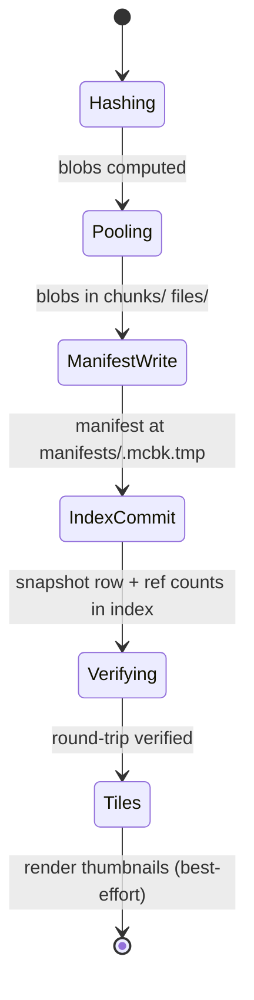

# Architecture

A vault is a directory chunkvault owns. This page describes what's in it,
how the parts fit together, and which invariants the operations rely on.

## On-disk layout

```
F:/Vaults/EX-Server/
├── index.sqlite                          ← lookup cache (rebuildable)
├── index.sqlite.bak                      ← rollback point (one only)
├── manifests/
│   └── <32-hex-id>.mcbk                  ← one per snapshot, durable truth
├── log-snapshots/
│   └── <32-hex-id>.mcbk                  ← one per log snapshot
├── chunks/                               ← MC chunk pool
│   └── ab/
│       └── abcd…                         ← content-addressed (blake2b-128)
├── files/                                ← non-MCA file pool
│   └── 12/
│       └── 12ab…                         ← content-addressed (sha256)
├── logs/                                 ← log file pool
│   └── 34/
│       └── 34cd…                         ← content-addressed (sha256)
├── tiles/                                ← Leaflet tiles, lazy
└── chunk-renders/                        ← per-chunk PNGs, lazy
```

The split into pool-letter subdirectories (`ab/`, `12/`, …) keeps any single
directory under ~256 entries — important for filesystems that scale poorly
on huge directories.

## The four storage primitives

### 1. Chunk pool (`chunks/`)

The main reason chunkvault exists. Each MC chunk's raw on-disk payload is
hashed with **blake2b-128** and stored once. The hash is the filename. A
"chunk" here is the byte slice MC writes into a `.mca` region — for internal
chunks that's the inline compressed NBT, for external chunks that's the
`.mcc` file's bytes. Either way: same bytes → same hash → one copy.

**Why blake2b-128 not sha256?**
128 bits is enough for collision resistance at our scale (we'd need 2⁶⁴
chunks before birthday-paradox collisions become non-negligible); blake2b is
faster than sha256 on modern CPUs; and it's fixed-size so we never need to
truncate or migrate.

### 2. File pool (`files/`)

For everything in the world tree that isn't a `.mca`: `level.dat`,
`playerdata/*.dat`, `data/*.dat`, datapacks, configuration files. Hashed
with **sha256**, content-addressed. Same dedup story as chunks; just
file-grain instead of chunk-grain.

### 3. Log pool (`logs/`)

Identical to the file pool, but for `logs/` and `crash-reports/`
directories. Logs go in their own pool because their lifecycle is different
(you might delete world snapshots aggressively but want to keep all logs;
or vice versa).

### 4. Tile pool (`tiles/`, `chunk-renders/`)

Lazily rendered PNG tiles for the Leaflet browser. Per-chunk renders are
content-addressed by chunk hash → palette mapping. If two snapshots share a
chunk, they share its render.

## The manifest

`manifests/<id>.mcbk` is a single zlib-compressed binary file describing one
snapshot:

```text
MAGIC "CVMF"      4 bytes
version           1 byte
body_length       4 bytes (big-endian)
zlib(body)        rest
```

The body lists every region's chunks (by `(rx, rz, cx, cz, content_hash,
compression, timestamp)`) and every non-region file (by `(rel_path,
sha256)`). It also carries the header: timestamp, label, world name,
mc_version, data_version, level.dat's `LastPlayed`, and the original
pre-retime timestamp.

Manifests are **durable truth**. If `index.sqlite` is corrupt or lost, the
vault can be fully rebuilt from manifests + the chunk/file/log pools alone
(though doing so requires a tool we haven't yet shipped — for now, restoring
the `.bak` covers all real-world cases).

## The SQLite index

`index.sqlite` is a lookup cache. Tables:

| Table              | Purpose                                                       |
| ---                | ---                                                           |
| `snapshots`        | One row per snapshot — id, label, ts, manifest path, mc ver…  |
| `log_snapshots`    | One row per log snapshot.                                     |
| `chunks`           | Presence + ref count for every chunk hash.                    |
| `files`            | Presence + ref count for every file hash.                     |
| `log_files`        | Presence + ref count for every log hash.                      |
| `region_cache`     | sha256(region bytes) → packed chunk records (snapshot fast path). |
| `chunk_renders`    | Per-chunk-hash → rendered PNG path (lazy tile cache).         |

Modes / settings:

- **WAL** &nbsp;— concurrent readers, single writer, crash-safe.
- **`synchronous=NORMAL`** &nbsp;— good throughput on writes; durable to
  process crashes (we don't need durability to OS crashes; the chunk pool
  is what carries the data, and an interrupted index update is recovered
  by `fsck`).
- **Foreign keys off** &nbsp;— we manage referential consistency in the
  application layer for performance.

## Atomic-write conventions

**Every** write goes through a temp file + rename:

- Manifests: `manifests/<id>.mcbk.tmp.<pid>` → `os.replace`.
- Chunk pool blobs: `chunks/ab/abcd….tmp.<pid>.<tid>.<rand>` → `os.replace`.
- File pool blobs: same pattern.
- Log pool blobs: same.
- Index transactions: SQLite `BEGIN IMMEDIATE` + `COMMIT`.

The `.tmp.<pid>.<tid>.<rand>` triple-tag on pool blobs is critical for
parallel snapshot: two threads in the same process writing the same hash
mustn't collide. The pid disambiguates processes; tid disambiguates threads
within one process; rand disambiguates re-attempts on the same thread.

## Snapshot lifecycle



Crash points and how `fsck` recovers:

| Crash before…         | On-disk state                                  | Fsck recovery                                  |
| ---                   | ---                                            | ---                                            |
| Pooling done          | Some `.tmp.<pid>` files                        | Delete stray temps.                            |
| ManifestWrite done    | Pool has new blobs, no manifest                | Pool blobs become orphans → reachable next gc. |
| IndexCommit done      | Manifest exists, no index row                  | Delete orphan manifest.                        |
| Verifying done        | Snapshot fully committed but unverified        | Nothing to do — caller can re-run `verify`.    |
| Tiles done            | Snapshot fully committed; tiles missing        | `chunkvault thumbnail --all` backfills.        |

## Idempotency

Snapshots are idempotent on `(label, timestamp_ms)` — calling `snapshot()`
with the same world at the same timestamp produces the same id. Re-ingest
of the same archive is a no-op.

The idempotency hinges on `level.dat`'s `LastPlayed` being the **only**
authority for a snapshot's timestamp. Filename-based timestamp parsing
(legacy) was unstable across re-ingests when filename formats varied —
that's fixed now by refusing servers without a readable `LastPlayed`.

## Two backends

chunkvault ships two storage backends:

1. **`chunk` (default)** &nbsp;— the architecture above. Use this.
2. **`git`** &nbsp;— a FastBack-style backend that stores whole region
   files as git blobs. Kept for backward compatibility and as a comparison
   point. Has worse dedup (region-grain, not chunk-grain) and slower
   diffs. Not recommended.

The CLI's `--store` flag selects between them; the library is just
`from chunkvault.store import ChunkSnapshotRepo` (chunk) vs.
`from chunkvault.storage import SnapshotRepo` (git).
